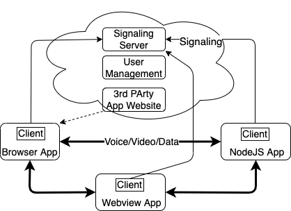

# Brume Client

Brume provides user-to-user (AKA peer-to-peer) data/voice/video between Brume users. Communication is directly between user devices without traversing a central server. Brume has three components:
- The core which provides [user onboarding and management](https://brume.occams.solutions) and a peer-to-peer signaling server to connect Brume users.
- The Brume client Javascript library that provides an API for web or platform-specific applications to establish connections to the Brume signaling server and between Brume clients. The client library can be used in browsers, [NodeJS](https://nodejs.org) and [Webview](https://github.com/boblund/brume-webviewapps).
- A [video chat and file transfer app](https://brume.occams.solutions/webapp). Simple example data sender and receiver apps are provided in this repo.

[Brume System Overview](#architecture)

[Client interface](#client)

[Peer instance](#peer)

[Using the example](#using)

[License](#license)

# Brume System Overview <a name="architecture"></a>


From a user's perspective the Brume system is a user account and applications that connect to each other using the Brume name. A user account is created using the [management system](https://brume.occams.solutions). New users get a free trial with 1,000 connection attempts that are valid for one year. Additional connetion attempts can be purchased.

Brume applications use the Brume client to establish signaling connections to the signaling server using the Brume name.  An application establishes a peer-to-peer connection to another receiving application using that application's Brume name. Each attempt by a Brume user to connect to another user is a <i>connection attempt</i>.

# Client Interface <a name="client"></a>

The Brume Client library is used in an application to create a client instance.

## Constructor

```
import { Brume } from './Brume.mjs';
const brume = new Brume;
```

Creates a new Brume instance. Returns a Brume instance.

## Methods

### brume.start( { token, url } )

Connect to the Brume signaling server:  
```token``` is a JWT required to connect to the Brume signaling server.  
```url``` is the Brume signaling server url. 

The JWT is either generated by logging into the Brume server with a user's email and password or by downloading a config file from the [Brume website](https://brume.occams.solutions).

This method must be called before a peer connection can be made or received.

```
brume.start( { token, url } );
```
### peer = await brume.connect( brumeName )

Creates a new WebRTC peer connection with a data channel to the Brume user specified by ```brumeName <string>```. Returns a Promise that resolves to a [simple-peer instance](#peer) or is rejected with an error code:  

```'ENODEST'``` brumeName is not connected to the Brume signaling server.  
```'EBADDEST'``` brumeName is not a Brume name.  
```'EOFFERTIMEOUT'``` The attempt to connect to brumeName timed out.  
```'ESERVER'``` An unspecified Brume signaling server error. 

```
try {
	const peer = await brume.connect( 'alice' );
	...
} catch( e ){
	//process error code e
}
```

### brume.thisUser()

Returns the \<string\> Brume name of this Brume instance.

```
myBrumeName = brume.thisUser();
```

### brume.onconnection( handler )

Registers a function ```handler``` to be called when a peer connection request is received; this is the counterpart to ```brume.connect( ... )```. The function is called with an object ```{ peer, accept }``` where the ```peer``` property contains a simple-peer instance and the ```accept``` property is an async function that is called to accept the offered connection, allowing the connection receiver to set up the peer instance before the WebRTC data channel is established.

```
function offerHandler( peer, accept ){
	// set up peer.on handlers
	await accept();
	// peer-to-peer data channel established
};

brume.onconnection( offerHandler );
```

### brume.stop()

Disconnect from the Brume signaling server.

```
brume.stop();
```

### Brume.encodeMsg( { type, data } )

Creates a Uint8Array encoded message of ```type``` containing ```data```.  
```type``` is a string identifying the format of ```data```  
```data``` is a Uint8Array

```
peer.send( Brume.encodeMsg( { type: 'action', data} ) );
```

### Brume.decodeMsg( msg );

Decodes an encoded msg returning the obejct { type, data }.

```
{ type, data } = Brume.decodeMsg( msg );
```

## Events

### brume.on( 'serverclose' )

Received when the Brume server closes the connection to this Brume instance. 

### brume.on( 'reauthorize', config )

Received if the token used in brume.start( ... ) has expired and a refresh token was used to generate a new token. ```config``` is a new config object with a new token. A refresh token is only available i the config file downloaded from the [Brume website](https://brume.occams.solutions).

# Peer Instance <a name="peer"></a>

Brume creates a peer instance of the [simple-peer](https://github.com/feross/simple-peer) Peer class when a connection request is made or received. Brume extends simple-peer in several ways.

## Peer connection creation

As noted, the peer instance created by Brume is already connected to the other peer and a data channel is configured. The offer/answer/candidate signaling has already been done by Brume.

An application can have multiple peer connections, each to a different Brume name.

## Media streams

All media streams are created dynamically, there is no option to do so when the peer is created. A Brume peer creates a media stream by:

```
function addMedia (stream) {
  peer1.addStream(stream) // <- add streams to peer dynamically
}

// then, anytime later...
navigator.mediaDevices.getUserMedia({
  video: true,
  audio: true
}).then(addMedia).catch(() => {})
```

A Brume peer receives notification of a stream by:

```
peer2.on('stream', stream => {
  // got remote video stream, now let's show it in a video tag
  var video = document.querySelector('video')

  if ('srcObject' in video) {
    video.srcObject = stream
  } else {
    video.src = window.URL.createObjectURL(stream) // for older browsers
  }

  video.play()
})
```
<span style="font-size:0.6em">Taken from [simple-peer dynamic streams](https://github.com/feross/simple-peer?tab=readme-ov-file#dynamic-videovoice)</span>

Brume handles all of the signaling generated by the above; the peers needn't and shouldn't use the simple-peer signal method or listen for 'signal' events.

## Data channel multiplexing

Brume defines a simple data channel protocol. Each message is an object ```{ type, data }``` where ```type``` is a string and ```data``` can be either a string or a Uint8Array. The message is sent as a Uint8Array. The Brume class static methods ```encode( ... )``` and ```decode( ... )``` are used by the sender and receiver.

## Dynamic media signaling over the data channel

Brume bypasses the signaling server and sends all signaling messages generated by dynamic media streams over the peer-to-peer data channel once it is created; the signaling server is no longer needed.

## Constructor

Peer instances are created in Brume; there is no publicly available Peer constructor.

## Methods

## peer.peerUsername

Contains the Brume ID of the far peer.

## peer.send and peer.write

An application must use ```Brume.encodeMsg``` and ```Brume.decodeMsg``` in order to take advantage of data channel multiplexing. This is not required.

## Events

## close and data

The Brume instance acts on these events to manage the peers it creates and for multiplexing signaling on the data channel. The events are then passed on to the application listeners. Brume will not work if the application calls ```removeAllListeners``` for these events.

# Using <a name="using"></a>

Install the repo.

```
git clone git@github.com:boblund/brume-client.git
cd brume-client
npm i
```

There are three examples showing the client use in NodeJS, browser and webview-nodejs.

## NodeJS

NodeJS apps require a config file containing the JWT and server URL to connect to the Brume signaling server. The default location for this file is: ```~/Brume/brume.conf```. This can be overidden by setting the environment varailbe ```BRUME_CONFIG```. The config file can be obtained by signing into [brume.occams.solutions](https://brume.occams/solutions), going to the ```Account``` tab and clicking ```Update configuration```.

The example has a sender and receiver app. These must be started with config files for different users. Assume you have two Brume accounts, 'alice' and 'bob'. The 'alice' config file is in the default location, i.e. ```~/Brume/brume.conf```. You've saved the 'bob' config in ```~/Brume/bob-brume.conf```. Then, to run the NodeJS example, in the brume-client directory start ```brumeReceiver.mjs``` first, then ```brumeSender```:

```
BRUME_CONFIG=~/Brume/joe.brume.conf node brumeReceiver.mjs&
node brumeSender.mjs
```

## Browser

You'll need a web server for this example. One is included in this repo. In the brume-client directory do:

```
node server.js .
```

A server is started on a random unused port. Then, in two separate browser tabs, go to: ```localhost:port```. Sign in as 'alice' and 'bob' then click the call button in one of the tabs. In the other tab, click to accept the call.

## Webview

The webview example runs the same code as the browser example except in webview-nodejs.

```
cd webview
npm i
node webpackBrume.mjs&
node webpackBrume.mjs
```

This will start an two webviews. Then follow the same steps as the browser example.

# License <a name="license"></a>

Creative Commons Attribution-NonCommercial 4.0 International

THIS SOFTWARE COMES WITHOUT ANY WARRANTY, TO THE EXTENT PERMITTED BY APPLICABLE LAW.
