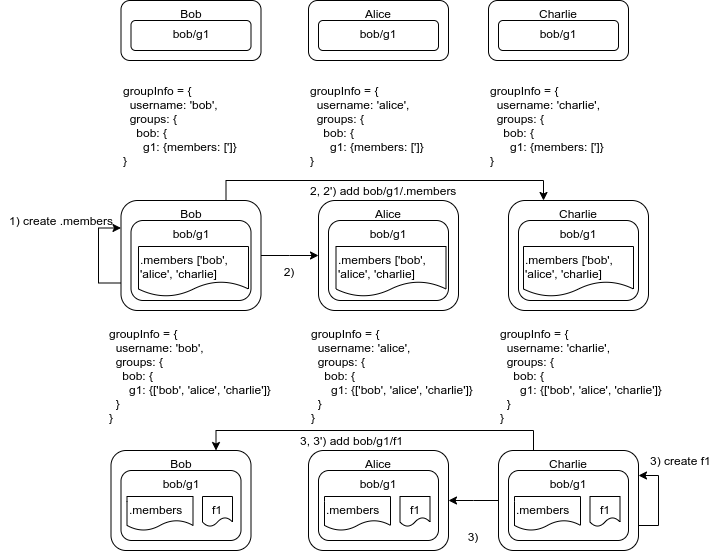
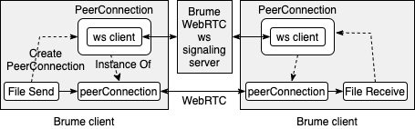

# brume-client

## Brume Overview

Brume provides a shared directoy service in which any file plaed in a directoy on a user's device is automtically shared with specified Brume users. File sharing is directly between user devices without traversing a central server. The only central component is the Brume signaling server required to setup user-to-user connections.

Brume is distinguished from other peer-to-peer file sharing, such as File Pizza and WormHole.io in that Brume runs in the background keeping shared folders in-sync as the the contents change; kind of like a dropbox without a server and across multiple user endpoints.

Brume shared content is organized by ```groups```. A Brume ```user```, the ```owner```of a ```group``` adds content to the ```group``` that is shared with other ```users``` who are ```members``` of the group. Sharing is one way - from the ```owner``` to the ```members```. Below is a simple example where Bob shares Bob/group/file with Alice and Alice shares Alice/group/file with Bob. 

```
BrumeFiles-Bob/            BrumeFiles-Alice/
├── Alice                  ├── Alice
│   └── group              │   └── group
│       └── file           │       ├── file                          
├── Bob                    │       └── .members
│   └── group              ├── Bob
│       ├── file           │   └── group
│       └── .members       │       └── file
└── .wsserver.json         └── .wsserver.json
```
Note that Bob/group/file is distinct from Alice/group/file; the combination ```user/group``` uniquely identifies shared content. Also note that file can be a folder containing a hierarchy of files and folders.

Actions (add, delete, modify) on the the content of the group by the owner are automatically reflected in each member of the group. Members *may* delete or modify content shared with them but this **will not** be reflected at the ower and these changes will be undone the next time the content of the group is synchronized. Group content is synchronized when either the owner or member Brume client is started.

Special file .members contains the name of members for each group. File .wsserver contains information required to connect to the Brume service

## Getting started

### Create a Brume account

Create a Brume account at brume.occams.solutions. You will need to create a username, select an account type and supply your email address and credit card (if you create a non-free account).

You will receive an email with your account configuration information that is needed to install Brume.

### Install Brume


Download the installer appropriate for your operating system. 
Figure 1 is a graphical representation of the example described above.    

<br/>
<center><br/><h3>Figure 1</h3></center>

## Brume architecture
<br/>
<br/>
<center><br/><h3>Brume Architecture</h3></center>
