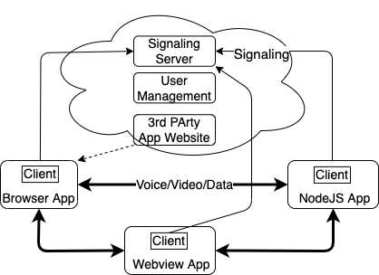

# Brume Client

Brume provides user-to-user (AKA peer-to-peer) data/voice/video between Brume users. Communication is directly between user devices without traversing a central server. Brume has three components:
- The core which provides [user onboarding and management](https://brume.occams.solutions) and a peer-to-peer signaling server to connect Brume users.
- The Brume client Javascript library that provides an API for web or platform-specific applications to establish connections to the Brume signaling server and between Brume clients. The client library can be used in browsers, [NodeJS](https://nodejs.org) and [Webview](https://github.com/boblund/brume-webviewapps).
- Brume applications, the [video chat and file transfer app](https://brume.occams.solutions/webapp) for example. Simple example data sender and receiver apps are provided in this repo.

[Brume System Overview](#architecture)

[Client interface](#client)

[Using the example](#using)

[License](#license)

# Brume System Overview <a name="architecture"></a>


From a user's perspective the Brume system is a user account which creates a Brume user name tied to the user's email address, and applications that connect to each other using the Brume name.

Each attempt by a Brume user to connect to another user is a <i>connection attempt</i>.

A user account is created using the [management system](https://brume.occams.solutions). New users get a free trial with 1,000 connection attempts that are valid for one year. Additional connetion attempts can be purchased.

Brume applications use the Brume client to establish signaling connections to the signaling server using the Brume name.  An application establishes a peer-to-peer connection to another receiving application using that application's Brume name.

# Client Interface <a name="client"></a>

The Brume Client library is used in an application to create a client instance.

```
import { Brume } from './Brume.mjs';
const brume = new Brume();
```

## Class Brume

### Brume() \< Brume \>

Create a new Brume instance. Returns a Brume instance.

```
const brume = new Brume;
```

### async brume.connect( brumeName \< String \> ) \< Promise \>

Try to connect to the user with ```brumeName```. Returns a Promise that either resolves to BrumePeer instance that has a WebRTC data channel to the peer for ```brumeName``` or is rejected with an error code:  

```ENODEST``` brumeName is not connected to the Brume signaling server.  
```EBADDEST``` brumeName is not a Brume name.  
```EOFFERTIMEOUT``` The attempt to connect to brumeName timed out.  
```ESERVER``` An unspecified Brume signaling server error. 

```
try {
	const peer = await brume.connect( 'alice' );
	...
} catch( e ){
	//process error code e
}
```

### brume.thisUser() \< String \>

Returns the Brume name of this Brume instance. The Brume instance derives its name from the JWT used in ```brume.start( ... )```.

```
const myBrumeName = brume.thisUser();
```

### brume.onconnection( \< Function >( { peer \< BrumePeer \>, accept \< async Function \> } )

Registers a function to be called when a connection request is received; this is the counterpart to ```brume.connect( ... )```. The function is called with an object where the ```peer``` property contains a BrumePeer instance. The ```accept``` property is an async function that is called to accept the offered connection. In this way, the connection receiver can set up its BrumePeer instance before the WebRTC data channel is established.

```
function offerHandler( peer, accept ){
	// set up peer.on handlers
	await accept();
	// peer-to-peer data channel established
};

brume.onconnection( offerHandler );
```

### brume.start( [ { token: \< String \>, url:  \< String \> } ] ) \< undefined \>

Connect to the Brume signaling server:  
```token``` is a JWT required to connect to the Brume signaling server.  
```url``` is the Brume signaling server url. 

```
brume.start( { token, url } );
```

### brume.stop() \< undefined \>

Disconnect from the Brume signaling server.

```
brume.stop();
```

## Class BrumePeer extends SimplePeer

BrumePeer is a subclass of [SimplePeer](https://www.npmjs.com/package/simple-peer). It supports the SimplePeer interface in addition to the following:
- BrumePeer will use the existing peer-to-peer data channel for subsequent signaling, for example dynamic creation of media streams.
- The peer-to-peer data channel provides a multiplexing scheme that identifies the type of data sent over the data channel, including signaling data.

There is no public constructor. Instances are created by the Brume class.

```
const brumePeer = brume.connect( 'alice' );
```

### BrumePeer.send( { type \< String \>, data \< Object \> } ) \< undefined \>

Sends ```{ type, data }``` over the data channel. ```type``` can be used by the receiver to determine how to handle ```data```. The value ```'signal'``` for ```type``` is reserved.

```
let msg = { type: 'start', data: { ...startParameters } };
brumePeer.send( msg );
let chunk = //Uint8Array data from a file
msg = { type: 'chunk', data: chunk };
```

### BrumePeer.on( 'data', ( { type, data } ) => { ... } )

Same as ```SimplePeer.on( 'data', ( data ) => { ... } )``` except the data parameter Object is expected to conform to that in ```BrumePeer.send```.

### BrumePeer.write( { type \< String \>, data \< Object \> } ) \< undefined \>

The equivalent of ```SimplePeer.write( ... )``` that conforms to the argument restrictions of BrumePeer.send.

# Using <a name="using"></a>

Install the repo.

```
git clone git@github.com:boblund/brume-client.git
cd brume-client
npm i
```

There are three examples showing the client use in NodeJS, browser and webview-nodejs.

## NodeJS

NodeJS apps require a config file containing the JWT and server URL to connect to the Brume signaling server. The default location for this file is: ```~/Brume/brume.conf```. This can be overidden by setting the environment varailbe ```BRUME_CONFIG```. The config file can be obtained by signing into [brume.occams.solutions](https://brume.occams/solutions), going to the ```Account``` tab and clicking ```Update configuration```.

The example has a sender and receiver app. These must be started with config files for different users. Assume you have two Brume accounts, 'alice' and 'bob'. The 'alice' config file is in the default location, i.e. ```~/Brume/brume.conf```. You've saved the 'bob' config in ```~/Brume/bob-brume.conf```. Then, to run the NodeJS example, in the brume-client directory start ```brumeReceiver.mjs``` first, then ```brumeSender```:

```
BRUME_CONFIG=~/Brume/joe.brume.conf node brumeReceiver.mjs&
node brumeSender.mjs
```

## Browser

You'll need a web server for this example. One is included in this repo. In the brume-client directory do:

```
node server.js .
```

A server is started on a random unused port. Then, in two separate browser tabs, go to: ```localhost:port```. Sign in as 'alice' and 'bob' then click the call button in one of the tabs. In the other tab, click to accept the call.

## Webview

The webview example runs the same code as the browser example except in webview-nodejs.

```
cd webview
npm i
node webpackBrume.mjs&
node webpackBrume.mjs
```

This will start an two webviews. Then follow the same steps as the browser example.

# License <a name="license"></a>

Creative Commons Attribution-NonCommercial 4.0 International

THIS SOFTWARE COMES WITHOUT ANY WARRANTY, TO THE EXTENT PERMITTED BY APPLICABLE LAW.
