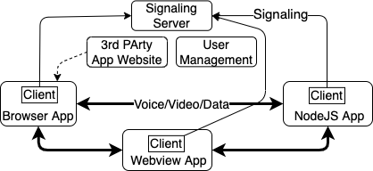

# Brume Client

Brume provides user-to-user (AKA peer-to-peer) data/voice/video between Brume users. Communication is directly between user devices without traversing a central server. This repo ```brume-client``` contains example Brume [NodeJS](https://nodejs.org), browser and [webview-nodejs](https://github.com/Winterreisender/webview-nodejs) applications.  

Brume has three components:
- [User onboarding and management](https://brume.occams.solutions) and a peer-to-peer signaling server to connect Brume users.
- The [brume-core](https://github.com/boblund/brume-core) API that applications use.
- [Brume-auth](https://github.com/boblund/brume-auth) and [brume-web](https://github.com/boblund/brume-web) that provide Brume server authentication, and web login, respectively.
- A [video chat and file transfer app](https://brume.occams.solutions/webapp). Simple example data sender and receiver apps are provided in this repo.

[Brume System Overview](#architecture)

[Client interface](#client)

[Peer instance](#peer)

[Installation and examples](#using)

[License](#license)

# Brume System Overview <a name="architecture"></a>


From a user's perspective the Brume system is a user account and applications that connect to each other using their Brume user name. A user account is created using the [management system](https://brume.occams.solutions). New users get a free trial with 1,000 connection attempts that are valid for one year. Additional connetion attempts can be purchased.  
  
Brume applications use the Brume client to first establish a signaling connections to the server, then establish a peer-to-peer connection to another application using that application's Brume user name. Each attempt by a Brume user to connect to another user is a <i>connection attempt</i>.

# Client Interface <a name="client"></a>

## Constructor

```
import { Brume } from './Brume.mjs';
const brume = new Brume( { wrtc, WebSocket } );
```

Creates a new Brume instance.  ```{ wrtc, WebSocket }``` must be supplied when used in NodeJS. Returns a Brume instance.

## Methods

### brume.start( { token, url } )

Connect to the Brume signaling server:  
```token``` is a JWT required to connect to the Brume signaling server.  
```url``` is the Brume signaling server url. 

The JWT is either generated by logging into the Brume server with a user's email and password or by downloading a config file from the [Brume website](https://brume.occams.solutions).

This method must be called before a peer connection can be made or received.

```
brume.start( { token, url } );
```
### peer = await brume.connect( brumeName )

Creates a new WebRTC, or returns an existing, peer connection with a data channel to the Brume user specified by ```brumeName <string>```. Returns a Promise that resolves to a [simple-peer instance](#peer) or is rejected with an error code:  

```'ENODEST'``` brumeName is not connected to the Brume signaling server.  
```'EBADDEST'``` brumeName is not a Brume name.  
```'EOFFERTIMEOUT'``` The attempt to connect to brumeName timed out.  
```'ENOSRV'``` Cannot create new peer because no signalling server connection.  
```'ESERVER'``` An unspecified Brume signaling server error. 

```
try {
	const peer = await brume.connect( 'alice' );
	...
} catch( e ){
	//process error code e
}
```

### brume.thisUser()

Returns the \<string\> Brume name of this Brume instance.

```
myBrumeName = brume.thisUser();
```

### brume.onconnection( handler )

Registers a function ```handler``` to be called when a peer connection request is received; this is the counterpart to ```brume.connect( ... )```. The function is called with an object ```{ peer, accept }``` where the ```peer``` property contains a simple-peer instance and the ```accept``` property is an async function that is called to accept the offered connection, allowing the connection receiver to set up the peer instance before the WebRTC data channel is established.

```
function offerHandler( peer, accept ){
	// set up peer.on handlers
	await accept();
	// peer-to-peer data channel established
};

brume.onconnection( offerHandler );
```

### brume.stop()

Disconnect from the Brume signaling server.

```
brume.stop();
```

### Brume.encodeMsg( { type, data } )

Creates a Uint8Array encoded message of ```type``` containing ```data```.  
```type``` is a string identifying the format of ```data```  
```data``` is a Uint8Array

```
peer.send( Brume.encodeMsg( { type: 'action', data} ) );
```

### Brume.decodeMsg( msg );

Decodes an encoded msg returning the obejct { type, data }.

```
{ type, data } = Brume.decodeMsg( msg );
```

## Events

### brume.on( 'serverclose' )

Received when the Brume server closes the connection to this Brume instance. 

### brume.on( 'reauthorize', config )

Received if the token used in brume.start( ... ) has expired and a refresh token was used to generate a new token. ```config``` is a new config object with a new token. A refresh token is only available i the config file downloaded from the [Brume website](https://brume.occams.solutions).

# Peer Instance <a name="peer"></a>

Brume creates a peer instance of the [simple-peer](https://github.com/feross/simple-peer) Peer class when a connection request is made or received. Brume extends simple-peer in several ways.

## Peer connection creation

As noted, the peer instance created by Brume is already connected to the other peer and a data channel is configured. The offer/answer/candidate signaling has already been done by Brume.

An application can have multiple peer connections, each to a different Brume name.

## Media streams

All media streams are created dynamically, there is no option to do so when the peer is created. A Brume peer creates a media stream by:

```
function addMedia (stream) {
  peer1.addStream(stream) // <- add streams to peer dynamically
}

// then, anytime later...
navigator.mediaDevices.getUserMedia({
  video: true,
  audio: true
}).then(addMedia).catch(() => {})
```

A Brume peer receives notification of a stream by:

```
peer2.on('stream', stream => {
  // got remote video stream, now let's show it in a video tag
  var video = document.querySelector('video')

  if ('srcObject' in video) {
    video.srcObject = stream
  } else {
    video.src = window.URL.createObjectURL(stream) // for older browsers
  }

  video.play()
})
```
<span style="font-size:0.6em">Taken from [simple-peer dynamic streams](https://github.com/feross/simple-peer?tab=readme-ov-file#dynamic-videovoice)</span>

Brume handles all of the signaling generated by the above; the peers needn't and shouldn't use the simple-peer signal method or listen for 'signal' events.

## Data channel multiplexing

Brume defines a simple data channel protocol. Each message is an object ```{ type, data }``` where ```type``` is a string and ```data``` can be either a string or a Uint8Array. The message is sent as a Uint8Array. The Brume class static methods ```encode( ... )``` and ```decode( ... )``` are used by the sender and receiver.

## Dynamic media signaling over the data channel

Brume bypasses the signaling server and sends all signaling messages generated by dynamic media streams over the peer-to-peer data channel once it is created; the signaling server is no longer needed.

## Constructor

Peer instances are created in Brume; there is no publicly available Peer constructor.

## Methods

## peer.peerUsername

Contains the Brume ID of the far peer.

## peer.send and peer.write

An application must use ```Brume.encodeMsg``` and ```Brume.decodeMsg``` in order to take advantage of data channel multiplexing. This is not required.

## Events

## close and data

The Brume instance acts on these events to manage the peers it creates and for multiplexing signaling on the data channel. The events are then passed on to the application listeners. Brume will not work if the application calls ```removeAllListeners``` for these events.

# Using <a name="using"></a>

## Install the repo.

```
git clone git@github.com:boblund/brume-client.git
cd brume-client
```

There are three examples showing the client use in NodeJS, browser and webview-nodejs. The client comprises three repos:
* [brume-core](https://github.com/boblund/brume-core): the Brume api
* [brume-auth](https://github.com/boblund/brume-auth): authentication for nodejs
* [brume-web](https://github.com/boblund/brume-web): HTML and JavaScript for browser and webview app login

## Run the nodejs example

```
cd nodejs
npm i
```

NodeJS apps will normally use a JWT stored in a config file at a default location ```~/Brume/brume.conf```. This can be overridden by setting the environment variable ```BRUME_CONF```. A user's config file can be downloaded from https://brume.occams.solutions in the Account tab.

In a terminal window start the receiver first:

```
cd .. # putting you in brume-client/nodejs directory
node brumeReceiver
```

In another terminal window start the sender with a different brume.conf:

```
BRUME_CONFIG=<path to some other brume.conf> node brumeSender.
```

### Run the browser example

```
cd browser
npm i
PORT=<some port> node server.js .
```

If PORT is not set the server will choose some random unused port.

In two different browser tabs go to ```localhost:port``` and log in with your Brume account email and password.

### Run the webview example

```
cd webview
npm i
npm run build
```

In two separate terminal windows run:

```
node webviewBrume.mjs
```

This will start two webviews. Then log in with your Brume account email and password.

The result of the webview build (webview/index.hml) can also be run in the a browser.

```
cd browser
PORT=<some port> node server.js ../webview
```

In two different browser tabs go to ```localhost:port``` and log in with your Brume account email and password.

# License <a name="license"></a>

Creative Commons Attribution-NonCommercial 4.0 International

THIS SOFTWARE COMES WITHOUT ANY WARRANTY, TO THE EXTENT PERMITTED BY APPLICABLE LAW.
